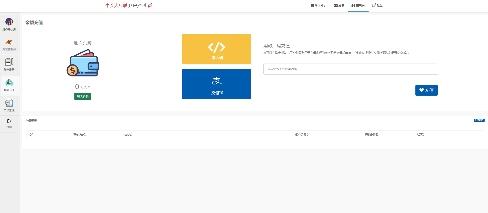

# peo

[](https://hub.docker.com/r/minoic/peo) [](https://github.com/minoic/peo) [](https://github.com/minoic/peo/releases)

🎮用于建立 [翼龙面板](https://github.com/pterodactyl/panel) 的自动售卖系统和附加控制系统，自动化你的翼龙面板出售。

目前已在 [demo](https://order.minoic.top) 稳定运行并跟进开发版本的部署（目前因网站备案原因暂停）。

主要用于 **Minecraft** 服务器的出售管理，暂不支持其它种类服务器的状态的信息获取

当前适配翼龙面板 v1.11.2

[minoic/peo - Docker Image | Docker Hub](https://hub.docker.com/r/minoic/peo)

## 截图




[更新日志](CHANGELOG.md)

## 特性

- [x] 登录、注册（首个用户为管理员）、找回密码、修改密码、改绑邮箱
- [x] 主页商品展示、建立订单、支持余额支付或 KEY 支付
- [x] 用户控制台：展示用户服务器信息、跳转控制台、运行时间记录、用同种 KEY 或余额自助续费
- [x] 工单系统
- [x] 用户消息通知
- [x] 用户可分享的公共相册
- [x] 管理员控制台：添加商品、整合包（Nest.Egg）、处理工单、管理相册、批量添加
  KEY、导出KEY
- [x] 周期任务：刷新缓存、检测服务器过期、检测 KEY 过期
- [x] 充值系统：支持 KEY 充值或支付宝扫码支付（基于支付宝当面付 API ）
- [x] 服务器到期自动邮件提醒用户、一定时间后在管理员控制台手动确认删除
- [x] 跟进 Pterodactyl 的新版本 API
- [ ] 优化模板复用，提高渲染效率
- [ ] 添加微信支付
- [x] 详细使用文档
- [ ] 支付方式集成到订单页
- [ ] 多语言国际化
- [x] 跳转翼龙面板时自动登录（需要开启 SSL 且在同一子域如 peo.A.com、pte.A.com）。
- [x] 修改配置存储方式为环境变量与本地数据库
- [ ] 添加用户列表控制页面
- [ ] 添加商品列表控制页面
- [ ] 添加订单列表控制页面

如有改进建议或需求欢迎发送 Issue 或 Pull Request

## 部署

### 二进制文件

1. 从 [release](https://github.com/minoic/peo/releases) 下载对应系统的发布软件包，解压。
2. 修改且仅修改 `conf/settings.toml` 中的配置，主要包含 Database Settings 中的内容（Mysql、Redis），其余配置可在网站中修改。
3. 运行可执行文件。

### Docker（推荐）

1. 安装 [Docker](https://www.runoob.com/docker/ubuntu-docker-install.html)、
   [Docker Compose](https://www.runoob.com/docker/docker-compose.html)。
2. 下载 [docker-compose.yml](./docker-compose.yml) 至任意文件夹。
3. 在该文件夹内打开终端，运行

```bash
docker-compose up
```

或在后台运行

```bash
docker-compose up -d
```

若去掉末尾 `-d` 则在前台运行，按 Ctrl+C 退出。

### 网关

使用 Nginx 等软件监听 80/443 端口，配置 SSL 后设置反向代理将根目录转发到 8080 端口

（仅限 Docker 方式）若不需要网关、HTTPS、域名复用等功能，可直接将 docker-compose.yml
中的

```yaml
    ports:
      - "8080:8080"
```

改为

```yaml
    ports:
      - "80:8080"
```

## 升级

### 二进制文件

下载新的软件包，将 static、views、二进制文件覆盖并重新运行，**不要覆盖设置文件**。

### Docker

在 `docker-compose.yml` 所在文件夹内，运行

```bash
docker-compose stop
docker-compose pull
docker-compose up -d
```

## 自 v0.1.x 升级到 v0.2.0

v0.2.0 版本对配置文件模块有修改，直接升级时系统会尝试对其进行转换，若发生异常请尝试备份，将压缩包内的文件解压缩并覆盖，手动重新填写配置。

新版本不再支持其它数据库，固定为 mysql + redis 的组合，但结构上并无修改，只要连接正确即可，

## 使用

访问服务器的目标网址，如 `http://localhost:8080`。

点击右上角登录，注册一个账号，系统注册的第一个账号将被设置为管理员。

打开管理员面板，找到左侧第二行“设置”，点击跳转到设置页面，填入所需信息。
